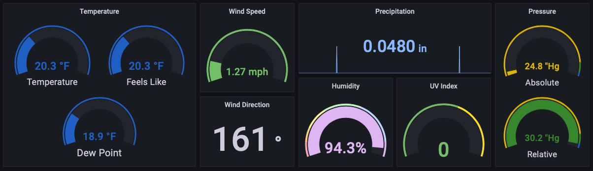

# wxdat #

[](https://pypi.org/project/wxdat)
[](LICENSE)
[](https://github.com/ambv/black)

A general purpose weather data recorder & explorer.



While the primary purpose of this library is to record weather data, it can also be
used as a framework for collecting weather information in other apps.

## Installation ##

Install the published package using pip:

```shell
pip3 install wxdat
```

This project uses `poetry` to manage dependencies and a local virtual environment.  To
get started, clone the repository and install the dependencies with the following:

```shell
poetry install
```

## Usage ##

Run the module and tell it which config file to use.

```shell
python3 -m wxdat --config wxdat.yaml
```

If you are using `poetry` to manage the virtual environment, use the following:

```shell
poetry run python -m wxdat --config wxdat.yaml
```

## Configuration ##

The configuration file is a YAML document with a list of stations to export.  See the
included default file for more details.

All stations have the following configuration values:
* name - must be unique
* type - the support station type

## Supported Stations ##

Eventually, I'd like to add local stations, not just online sources.  Please see
the example configuration file for details on each provider.

* AccuWeather
* Ambient Weather Network
* OpenWeatherMap
* National Weather Service (NOAA)
* Weather Underground

## Unit Conversion ##

`wxdat` also includes a limited set of conversion helpers for working with units.  In
general, the pattern for using them is:

```python
from wxdat import units

# convert 100.0 from celsius to fahrenheit
temp = units.degC(100).degf
```

## Contributing ##

To submit a new issue, please visit the [Issues](https://github.com/jheddings/wxdat/issues)
page.

If you are unsure where to start, create a post in the
[Discussions](https://github.com/jheddings/wxdat/discussions) area.

Additionally, [Pull Requests](https://github.com/jheddings/wxdat/pulls) are welcome.
